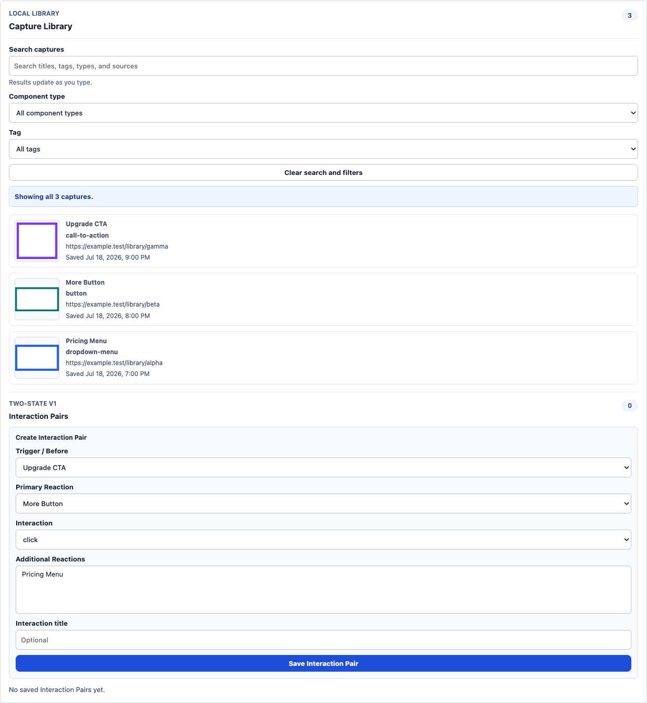
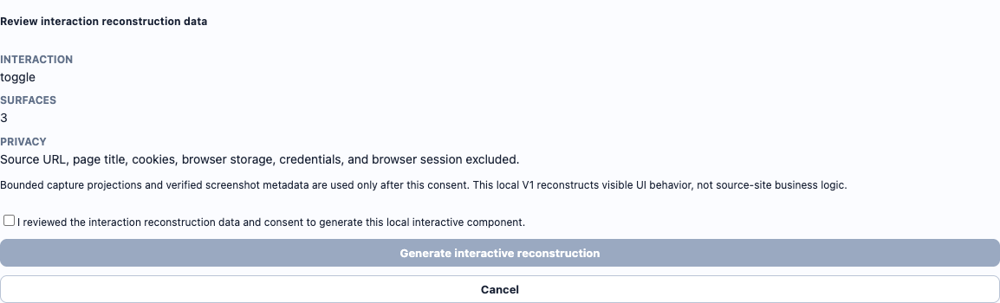
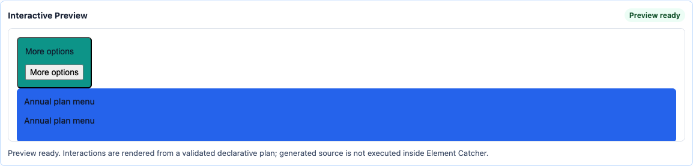
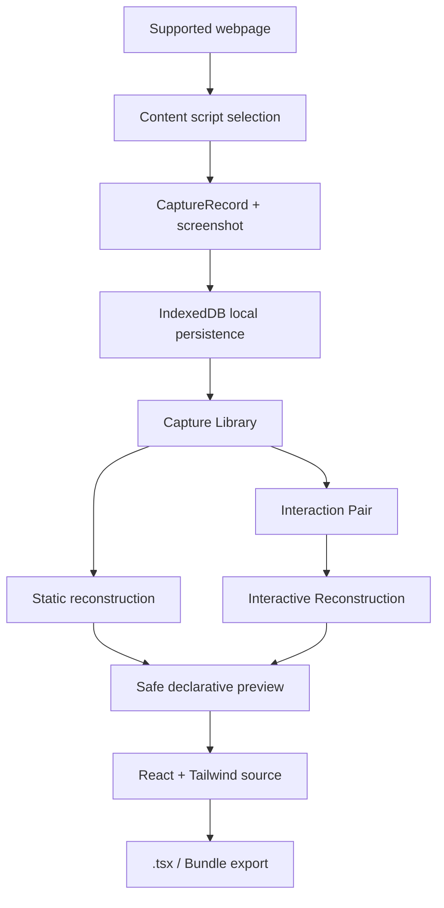

# Element Catcher

Element Catcher is a local-first Chrome extension for capturing UI elements from the web and turning them into reusable React + Tailwind components.

> Capture UI inspiration from the web and turn it into reusable React + Tailwind components, including interaction states.



## Why Element Catcher

Designers, front-end learners, product managers, and indie builders constantly notice useful UI patterns while browsing: buttons, cards, menus, pricing blocks, dropdowns, forms, and polished call-to-action sections. Screenshots are easy to save, but they lose structure. Generic screenshot-to-code workflows start after the fact and do not preserve the browser-session context where the reference was found.

Element Catcher turns that moment of inspiration into a reusable component workflow. It captures a visible element from a supported page, saves structured DOM/style context and a screenshot locally, and lets the user rebuild, preview, compare, revise, and export reusable React + Tailwind source.

## Demo Flow

```text
Capture -> Save -> Reconstruct -> Interact -> Export
```

1. Capture a visible element from a supported webpage.
2. Save its structured DOM/style projection and screenshot locally.
3. Optionally relate before/reaction captures through an Interaction Pair.
4. Reconstruct static or bounded interactive React + Tailwind.
5. Preview through a restricted, declarative preview boundary.
6. Export exact `.tsx` source or a source-only Bundle V1 ZIP.

Static AI generation remains available when a local backend/provider is configured. The strongest portfolio demo is the local Interaction Reconstruction path, because it does not require a paid provider.

## Key Capabilities

- **Element-level capture:** Highlight, lock, refine, and confirm visible UI elements on supported `http://` and `https://` pages.
- **Local Capture Library:** Save captures in IndexedDB, reopen them, edit user-managed metadata, search, filter, and delete atomically.
- **React + Tailwind reconstruction:** Generate reusable component source through the configured provider-neutral backend path with explicit Review and consent.
- **Interaction Capture:** Model a user-designated UI interaction as Trigger / Before, Interaction, Primary Reaction, and optional Additional Reactions.
- **Interactive Reconstruction:** Turn a complete Interaction Pair into bounded interactive React + Tailwind source using sanitized DOM/text/style/layout capture projections.
- **Safe Preview:** Preview generated or reconstructed UI through validated data-only render plans; generated source is not arbitrarily executed in the preview realm.
- **Revision and Comparison:** Revise/regenerate persisted generated versions, then compare two versions locally with a bounded source diff.
- **Export:** Export exact persisted `.tsx` source, a source-only Bundle V1 ZIP, or use the deterministic fake/development GitHub export workflow.

## Interaction Reconstruction

Example:

```text
More button -> toggle -> dropdown appears
```



Element Catcher represents interaction states explicitly:

- **Trigger / Before:** the visible element before interaction, such as a More button.
- **Interaction:** one supported event type: click, toggle, hover, or focus.
- **Primary Reaction:** the main visible UI state after the interaction, such as a dropdown.
- **Additional Reactions:** optional extra visible states that appear at the same time, such as a CTA or secondary panel.

M12 reconstructs a bounded interactive component from the reviewed Interaction Pair. The local deterministic mapper uses sanitized DOM text, child summaries, computed-style projection, layout hints, color, spacing, typography, border, radius, and shadow signals. It does not clone source-site JavaScript, infer hidden business logic, or promise pixel-perfect output.



## Architecture



## Privacy And Safety

- Captures are local-first. Saved CaptureRecords and screenshot assets live under the extension origin in IndexedDB.
- AI generation, revision, and regeneration are separate user actions with explicit Review and consent.
- Generation projections exclude source URL, page title, local persistence IDs, screenshot storage keys, browser storage, cookies, notes, raw idempotency keys, raw wrappers, browser session, and credentials.
- Generated source is displayed as inert text unless the user explicitly previews an accepted subset.
- Preview uses validated declarative render plans inside isolated packaged preview frames.
- Interactive preview uses `InteractivePreviewPlanV1`; generated interactive source is exported and displayed, but the Element Catcher preview does not execute arbitrary generated code.

## Quick Start

Prerequisites:

- Node.js 20 or newer
- npm
- Google Chrome with extension Developer mode enabled

Install dependencies:

```bash
npm install
```

Build the extension:

```bash
npm run build
```

Load in Chrome:

1. Open `chrome://extensions`.
2. Turn on Developer mode.
3. Choose Load unpacked.
4. Select the generated `dist/` directory.
5. Open Element Catcher from the extension icon or Side Panel entry.

Useful development commands:

```bash
npm run dev
npm run build:extension
npm run test:e2e
```

## Demo Boundaries

Element Catcher v0.1 is a bounded local-first portfolio demonstration. It is not a production SaaS product, Chrome Web Store release, hosted multi-user backend, or production GitHub integration.

Important limitations:

- Capture works only on supported ordinary webpages where Chrome permits extension access.
- Restricted Chrome surfaces, Chrome Web Store pages, browser UI, inaccessible cross-origin iframes, and closed shadow roots are unsupported.
- The product must not bypass authentication, paywalls, permissions, or access controls.
- Interactive Reconstruction is a bounded visual approximation, not pixel-perfect reproduction or business-logic cloning.
- Normal runtime GitHub export is fail-closed; real GitHub OAuth, token storage, REST writes, PRs, releases, Pages, and deployments are not implemented.
- Bundle export is source-only, not a runnable application scaffold or dependency-complete package.

## Project Status

**v0.1 portfolio build complete - M1-M12 accepted.**

Accepted M12 baseline:

```text
e56e00872d1bd4d15e3d19b666804d0ff5a2a308 feat: harden M12 visual reconstruction
```

Detailed milestone history, schemas, architecture notes, and readiness gaps remain in `docs/`:

- [Portfolio Demo Guide](docs/PORTFOLIO_DEMO_GUIDE.md)
- [Portfolio Case Study](docs/PORTFOLIO_CASE_STUDY.md)
- [Roadmap and milestone history](docs/ROADMAP.md)
- [Capture schema](docs/CAPTURE_SCHEMA.md)
- [Chrome Web Store readiness gaps](docs/CHROME_WEB_STORE_READINESS_GAPS.md)
